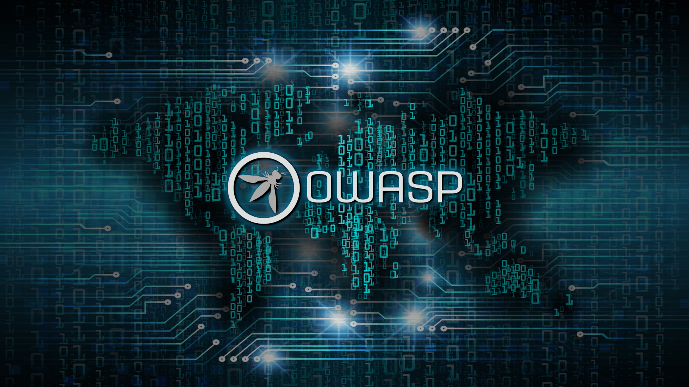
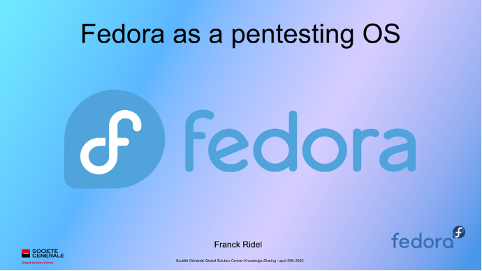
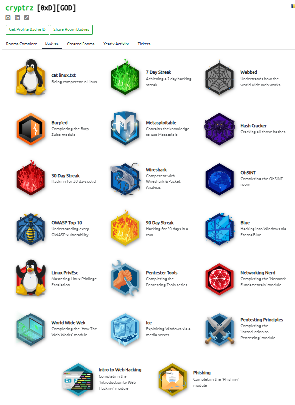
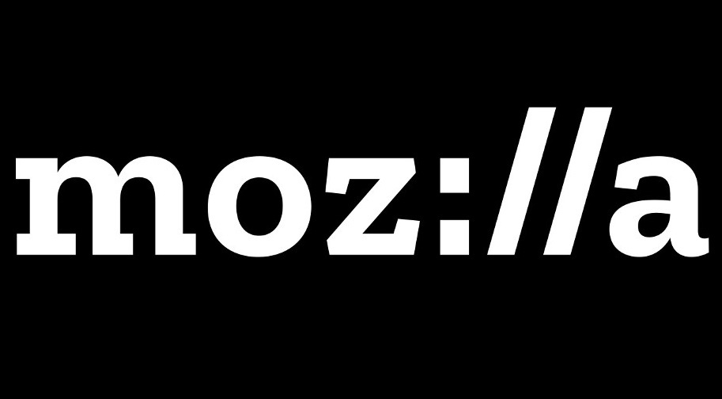
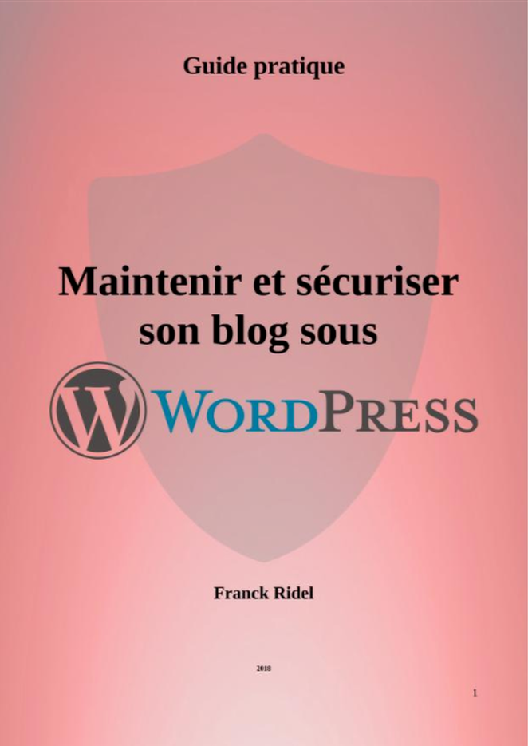
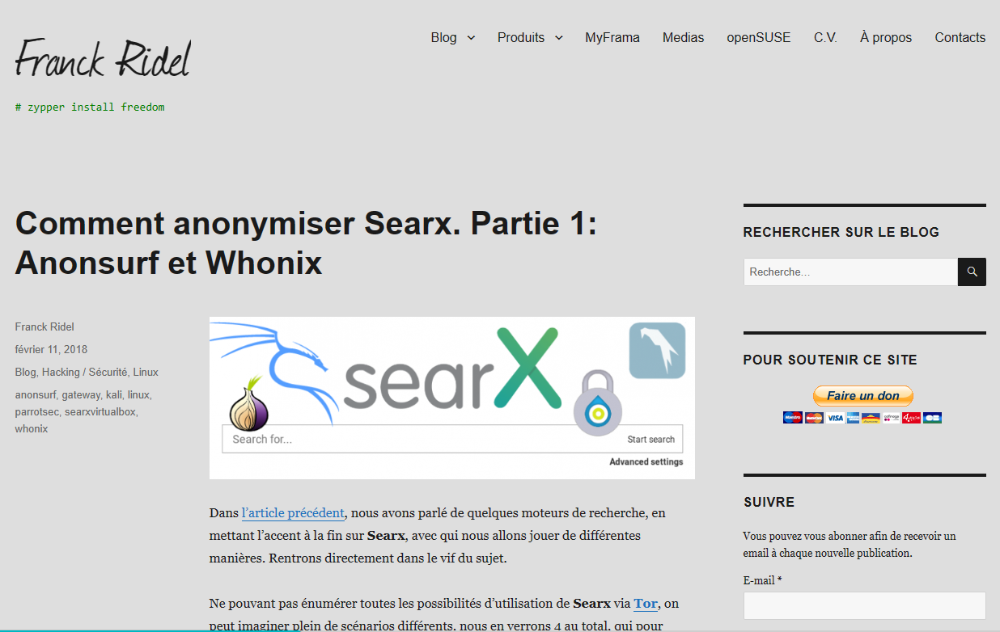

# Penetration Tester for Société Générale (dec 21th - Present)

Work in collaboration with the G3C team based in Bangalore, India (I work from Bucharest, Romania): Web Apps and Infra Penetration Testing and Security Risk Assessments for Société Générale and its subsidiaries around the world. Helping developer teams understand and fix found vulnerabilities during the penetration test, and translating reports for teams working in French countries. Did a video conference to technical teams showing how to use Fedora Linux as a pentester operating system and avoid Debian-based distributions to people comfortable with Fedora, CentOS and Red Hat

Website: [https://globalsolutioncentre.societegenerale.ro](https://globalsolutioncentre.societegenerale.ro/) 

<video width="320" height="240" controls>
  <source src="../assets/videos/sggsc.mp4" type="video/mp4">
</video>

## OWASP contributor (2022 - Present)

OWASP and Zed Attack Proxy advocate, bug reports, online help on Slack, Discord, Reddit

For any questions regarding OWASP: **franck.ridel@owasp.org**

# Fedora as a pentesting OS (2022)

This is a presentation made in 2022 for Société Générale technical teams. Instead of using Kali Linux or Parrot OS or pentesting, I shared my knowledge about my favorite Linux distribution and explained how Red Hat, CentOS and Fedora users can use Fedora Linux as a pentesting operating system if this system is more comfortable for them.

PowerPoint: [https://docs.google.com](https://docs.google.com/presentation/d/e/2PACX-1vS3ccFjUQ1S2Hvf5HL6PTRmTN8SRjo8KHc-tcL_DFeRL2FX0PlK2u2nkOaPbQBRGkgQDsyiC9tOrZ91/pub?start=false&loop=false&delayms=3000&slide=id.p1)

# TryHackMe Top 1%, level 13 (2020 - Present)

**TryHackMe** is a free online platform for learning cyber security, using hands-on exercises and labs, all through your browser!

Profile: [https://tryhackme.com/p/cryptrz](https://tryhackme.com/p/cryptrz)

# Mozilla contributor (2020 - Present)

Provide technical support on different platforms owned or not by Mozilla, help for french translations and Common Voice project

Profile: [https://support.mozilla.org/en-US/user/cryptrz/](https://support.mozilla.org/en-US/user/cryptrz/)

# **eBook: Maintenir et Sécuriser son Blog sous Wordpress / Maintaining and securing your Wordpress blog (2018)**

*English below*

Le guide de 40 pages « Maintenir et sécuriser son blog sous WordPress » vous expliquera les bases de la sécurité informatique et comment les appliquer sur votre site ou votre blog WordPress. Il se compose de 3 parties, la première est accessible à tous, la seconde s'adresse à un public averti, et la troisième est une liste de conseils à appliquer au quotidien. Pour finir, un glossaire en fin de guide vous expliquera les mots et acronymes techniques.

English:

The 40-page guide "Maintaining and securing your WordPress blog" explains the basics of IT security and how to apply them to your WordPress site or blog. It is divided into 3 parts: the first is accessible to everyone, the second is aimed at a more informed audience, and the third is a list of tips to apply on a daily basis. Finally, a glossary at the end of the guide explains technical words and acronyms.

eBook: [https://archive.org/details/maintenir-et-securiser-blog-wordpress/mode/2up](https://archive.org/details/maintenir-et-securiser-blog-wordpress/mode/2up)

# franck-ridel.fr (former blog 2016-2018)

This site powered by Wordpress was a personal project focused on computing, more mainly on the Linux world and programming. Total freedom of expression was its only guideline.

Archive: [https://web.archive.org/web/20180510190351/https://franck-ridel.fr/](https://web.archive.org/web/20180510190351/https://franck-ridel.fr/) 

